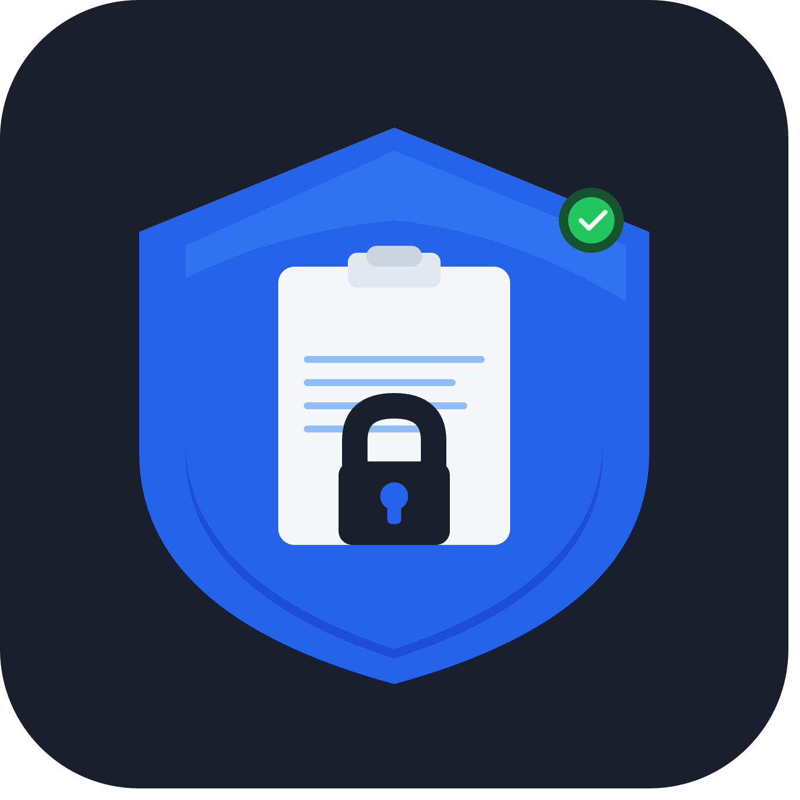

<div align="center">



# PasteShield

**Clipboard security scanner for VS Code**

Detects secrets, unsafe patterns, and vulnerabilities *before* they land in your code.

[](https://marketplace.visualstudio.com/items?itemName=NK2552003.pasteshield)
[](https://marketplace.visualstudio.com/items?itemName=NK2552003.pasteshield)
[](LICENSE)
[](https://code.visualstudio.com)

</div>

---

## Overview

PasteShield intercepts every paste (`Ctrl+V` / `Cmd+V`) in the editor and scans the clipboard content for dangerous patterns — API keys, hardcoded passwords, unsafe JavaScript, prototype pollution, and more — before the text ever reaches your file.

> **Replace the GIF below with a screen recording of PasteShield warning on a paste.**

<div align="center">
  
</div>

---

## Features

### 🔍 Real-time paste interception
Every `Ctrl+V` / `Cmd+V` is scanned instantly. If a risk is detected you get a clear warning with severity, pattern name, and the option to proceed or cancel — all without ever leaving the editor.

### 🛡️ Inline CodeLens warnings
PasteShield also scans already-open files and surfaces CodeLens annotations directly above risky lines. Each lens shows the severity and provides one-click actions: view details, ignore the pattern, or open settings.

> **Replace the GIF below with a screen recording of CodeLens annotations.**

<div align="center">
  
</div>

### 🎯 Severity levels
Filter noise by choosing the minimum severity that triggers a warning:

| Level | What it catches |
|---|---|
| **Critical** | API keys, private keys, database credentials |
| **High** | JWTs, hardcoded passwords, prototype pollution |
| **Medium** *(default)* | `eval()`, `innerHTML`, `document.write` |
| **Low** | `setTimeout`/`setInterval` with string arguments |

### 📋 Scan report
Run **PasteShield: Show Last Scan Report** from the command palette to review a full breakdown of everything detected in the last paste — pattern names, severities, and matched content.

### ⚙️ Granular control
- Ignore specific patterns by name
- Disable scanning for chosen languages (e.g. `markdown`, `plaintext`)
- Exclude specific files from CodeLens scanning
- `.env` and `.env.local` files are always excluded automatically

---

## Installation

**From the VS Code Marketplace:**

1. Open VS Code
2. Press `Ctrl+Shift+X` (Extensions)
3. Search for **PasteShield**
4. Click **Install**

**From a `.vsix` file:**

```bash
code --install-extension pasteshield-1.0.0.vsix
```

Or drag-and-drop the `.vsix` into the Extensions panel.

---

## Usage

PasteShield activates automatically on startup — no configuration needed.

| Action | How |
|---|---|
| Paste with scan | `Ctrl+V` / `Cmd+V` (automatic) |
| Toggle on/off | Command Palette → **PasteShield: Toggle On/Off** |
| View last scan report | Command Palette → **PasteShield: Show Last Scan Report** |
| Toggle via right-click | Editor context menu → **PasteShield** group |

---

## Configuration

All settings are available under **Settings → PasteShield** or in your `settings.json`.

```jsonc
{
  // Enable or disable all clipboard scanning
  "pasteShield.enabled": true,

  // Minimum severity that triggers a warning
  // Options: "critical" | "high" | "medium" | "low"
  "pasteShield.minimumSeverity": "medium",

  // Show a gutter decoration at the paste point (auto-clears after 10s)
  "pasteShield.showInlineDecorations": true,

  // Show CodeLens warnings above risky lines in open files
  "pasteShield.showCodeLens": true,

  // Patterns to skip by name (get names from the scan report)
  "pasteShield.ignoredPatterns": [],

  // Language IDs where paste scanning is disabled
  "pasteShield.ignoredLanguages": [],

  // Extra file basenames to exclude from CodeLens scanning
  "pasteShield.codeLensExcludedFiles": []
}
```

---

## Commands

All commands are available via the Command Palette (`Ctrl+Shift+P` / `Cmd+Shift+P`):

| Command | Description |
|---|---|
| `PasteShield: Toggle On/Off` | Enable or disable PasteShield globally |
| `PasteShield: Show Last Scan Report` | View the full report from the last paste scan |

---

## Privacy

PasteShield runs **entirely offline**. Clipboard content is never sent to any server, logged, or stored beyond the current VS Code session. The scan report is held in memory only and cleared when VS Code closes.

---

## Contributing

Contributions are welcome! Please read [CONTRIBUTING.md](CONTRIBUTING.md) before submitting a pull request.

```bash
# Clone the repo
git clone https://github.com/sidkr222003/pasteshield.git
cd pasteshield

# Install dev dependencies
npm install

# Compile in watch mode
npm run watch

# Press F5 in VS Code to launch the Extension Development Host
```

---

## License

[MIT](LICENSE) © 2024 NK2552003
